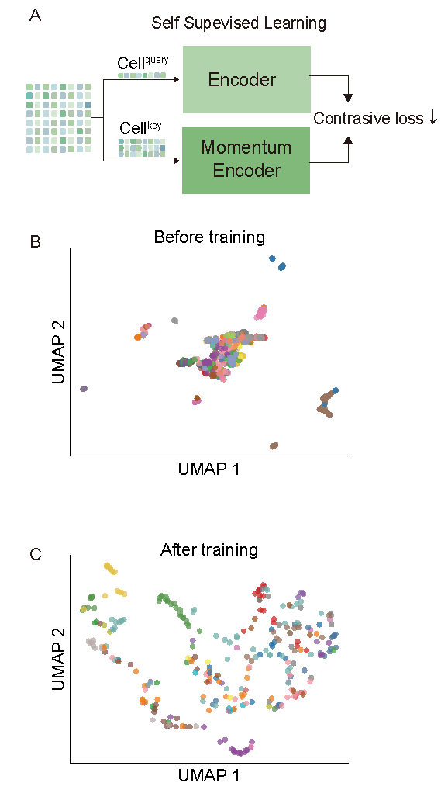
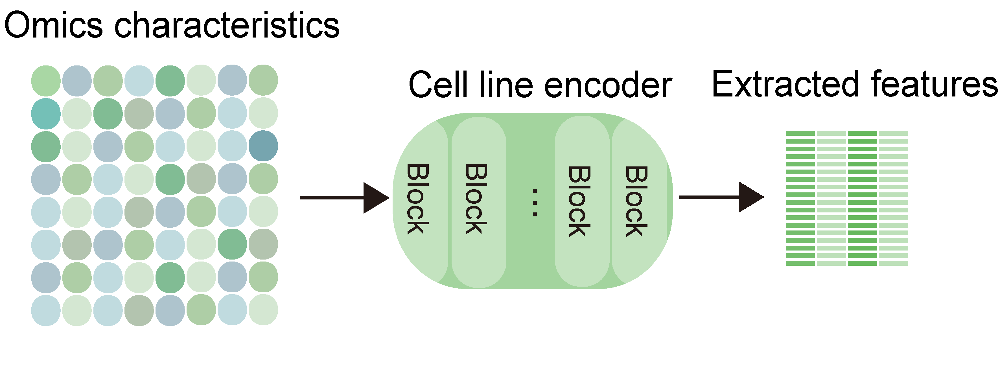
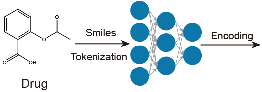
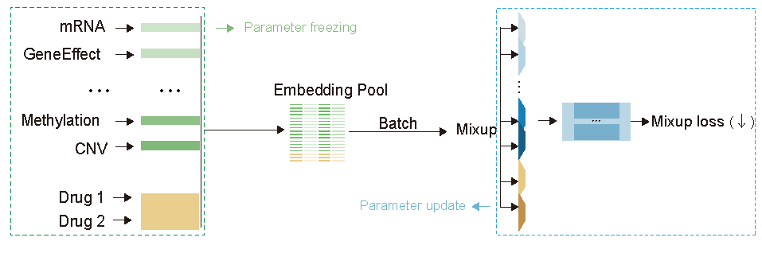

# AXIS

**An Attribution-based Cross-interaction Model for Interpretable Drug Synergy Prediction and Mechanistic Insight**

---

## 📋 About

We present **AXIS**, an interpretable deep learning framework that integrates chemical language models, self‑supervised omics encoders, and a multi‑source cross‑attention module. AXIS not only predicts drug synergy but also uncovers the underlying biological mechanisms driving the predictions.


---

## 🚀 1. Installation

Set up the environment with the following commands:

```bash
conda env create -f environment.yml
conda activate AXIS
pip install -r requirements.txt
```

Due to GitHub's file size limitations, the following files must be downloaded from [Zenodo](https://doi.org/10.5281/zenodo.20206011):

- `AXIS.pth` → place it in the `models/` folder
- `DrugComb_tem_full.csv` → place it in the `data/DrugComb/` folder

---

## 📘 2. Quick Usage

### 2.1. Demo Scripts

We provide demo notebooks for quick testing:

- **`notebooks/Data_Process_Demo.ipynb`** – Quickly generates a demo dataset containing 2500 samples.  
- **`notebooks/Train_Demo.ipynb`** – Demonstrates the training process using the demo data and verifies that your environment is correctly set up.

> ⚠️ **Note:** The demo data is intended only for workflow illustration. Performance obtained with the demo is **not** representative of the full model.

### 2.2. Full Training & Prediction

To train and predict on the complete dataset, follow these steps:

1. **Data preparation** – Run `notebooks/Data_Process.ipynb`  
2. **Training** – Run `notebooks/Train.ipynb`  
3. **Prediction** – Run `notebooks/Predict.ipynb`

### 2.3. Model Interpretability

- **`Single_Combination_Contribution_Visualization.ipynb`** – This notebook reproduces the results shown in **Figure 4** of the paper. It generates SHAP contribution heatmaps for drug substructures (illustrated with the docetaxel‑tamoxifen‑NCIH838 combination) and performs enrichment analysis of the top‑N genes (by absolute SHAP contribution) across three drug‑related gene sets.

> Drug substructure contribution maps for sorafenib


> Validation of top‑ranked genes for linsitinib–sorafenib in MELHO identified by AXIS in the TTD (Therapeutic Target Database)


---

## 3. Training from Scratch

### 3.1. Cell Line Encoder Pretrain

#### 3.1.1. Data Preparation

- `./MOCO/data_process_Depmap.ipynb` and `./MOCO/data_process_Depmap_mutation_top_var.ipynb` – Process Depmap data.  
- Metabolomics data can be downloaded from Depmap.  
- Proteomics data can be downloaded from: [https://tcpa.drbioright.org/rppa500mclp/#/download](https://tcpa.drbioright.org/rppa500mclp/#/download)  
- KEGG pathway annotations were obtained from the GSEA database ([https://www.gsea-msigdb.org](https://www.gsea-msigdb.org)).  
- KEGG pathway activity scores were computed from the DepMap transcriptomic data using the ssGSEA algorithm.

#### 3.1.2. Cell Line Encoder Pretrain

Run the following commands in the `./MOCO` folder.

##### 3.1.2.1. Environment Setup

```bash
conda env create -f environment.yml
conda activate MOCO
pip install -r requirements.txt
```

##### 3.1.2.2. Multi‑omics Data Processing

Depmap data should be downloaded from the official Depmap website and placed in the `./MOCO/data/Depmap` directory.

- **`./MOCO/data_process_Depmap.ipynb`** – Processes and standardizes the omics data.  
- **`./MOCO/data_process_Depmap_mutation_top_var.ipynb`** – Processes mutation data.  
- **`./MOCO/performance_Depmap.ipynb`** – Visualizes UMAP projections of the data before and after training.  
- **`./MOCO/GeneFeatureMOCO_Depmap_ProteinCodingGene.ipynb`** – Demonstrates how to extract omics features using the pre‑trained cell line encoder, using mRNA data as an example.

##### 3.1.2.3. Cell Line Encoder Training



Using mRNA data as an example, run the following command to train the model:

```bash
cd ./MOCO   # Replace with the actual path to your MOCO folder
PYTHON=~/miniconda3/envs/MOCO/bin/python   # Path to your Python interpreter in the MOCO environment
export CUDA_VISIBLE_DEVICES=1,2,3,4        # Specify GPU IDs for training

$PYTHON main.py --arch densenet27 \
    --dist-url "tcp://localhost:10029" \
    --outdir "./result/mRNA_protein" \      # Replace with your output path for the chosen omics
    --file ./data/zscore_train_Depmap_ProteinCodingGene_mRNA.npz \   # Replace with your omics data file
    --epochs 200 \
    --num_batches 16 \
    --schedule 80
```

### 3.2. Feature Extraction

#### 3.2.1. Cell Line Feature Extraction

- **`./MOCO/GeneFeatureMOCO_Depmap_ProteinCodingGene.ipynb`** – Uses mRNA data as an example to extract encoded mRNA features.



#### 3.2.2. Drug Feature Extraction

- **`notebooks/Features/Drug_Feature_Extract.ipynb`** – Converts drug SMILES strings into feature vectors for subsequent model training.



### 3.3. Second‑Stage Model Training



- **`./notebooks/Data_Process.ipynb`** – Prepares data for the second‑stage training.  
- **`./notebooks/Train.ipynb`** – Trains the second‑stage model.  
- **`./notebooks/Evaluate.ipynb`** – Performs model prediction.

---

## 4. Interpretability from Scratch

- **`./notebooks/SHAP/SHAP_drug2mid.ipynb`** – Generates SHAP values from drug features to mid‑level features.  
- **`./notebooks/SHAP/SHAP_cell2mid.ipynb`** – Generates SHAP values from cell line features to mid‑level features.  
- **`./notebooks/SHAP/Background_datasets_genarate.py`** – Creates the background dataset for the synergy score prediction model.  
- **`./notebooks/SHAP/SHAP_mid2drug.ipynb`** – Generates SHAP values from mid‑level features to the synergy score.  
- **`Single_Combination_Contribution_Visualization.ipynb`** – Integrates the SHAP values from the previous steps and produces the final visualizations.
