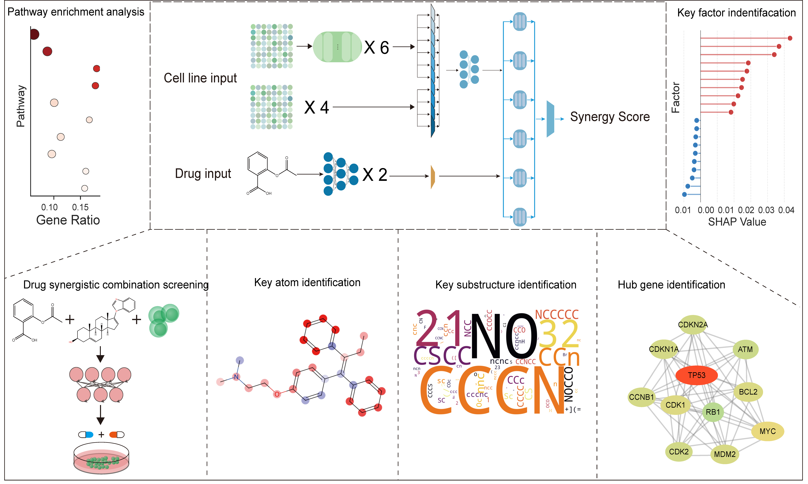
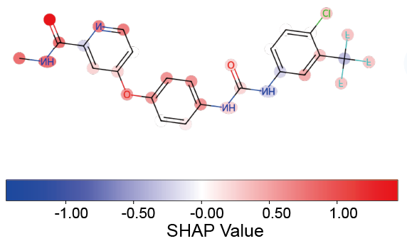
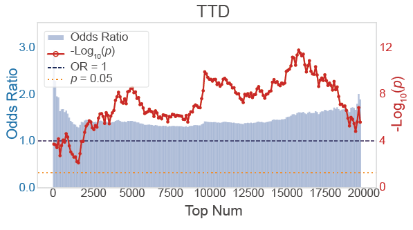

# AXIS

**An Attribution-based Cross-interaction Model for Interpretable Drug Synergy Prediction and Mechanistic Insight**


---

## 📋 About

We present **AXIS**, an interpretable deep learning framework that integrates chemical language models, self‑supervised omics encoders, and a multi‑source cross‑attention module. AXIS not only predicts drug synergy but also uncovers the underlying biological mechanisms driving the predictions.




---

## 🚀 Installation

Set up the environment with the following commands:

```bash
conda env create -f environment.yml
conda activate AXIS
pip install -r requirements.txt
```


Due to GitHub's file size limitations, the following files must be downloaded from Zenodo: https://doi.org/10.5281/zenodo.20206011

- AXIS.pth → place it in the models/ folder

- DrugComb_tem_full.csv → place it in the data/DrugComb/ folder


---


## 📘 Usage


### Demo Scripts

We provide demo notebooks for quick testing:

- **`notebooks/Data_Process_Demo.ipynb`** – Quickly generates a demo dataset containing 2500 samples.  
- **`notebooks/Train_Demo.ipynb`** – Demonstrates the training process using the demo data and verifies that your environment is correctly set up.

> ⚠️ **Note:** The demo data is intended only for workflow illustration. Performance obtained with the demo is **not** representative of the full model.


### Full Training & Prediction

To train and predict on the complete dataset, follow these steps:

1. **Data preparation** – Run `notebooks/Data_Process.ipynb`  
2. **Training** – Run `notebooks/Train.ipynb`  
3. **Prediction** – Run `notebooks/Predict.ipynb`


---

### Model Interpretability


- **`Single_Combination_Contribution_Visualization.ipynb`** – This notebook reproduces the results shown in **Figure 4** of the paper. It generates SHAP contribution heatmaps for drug substructures (illustrated with the docetaxel‑tamoxifen‑NCIH838 combination) and performs enrichment analysis of the top-N genes (by absolute SHAP contribution) across three drug‑related gene sets.

**Drug substructure contribution maps for sorafenib**



**Validation of top-ranked genes for linsitinib–sorafenib in MELHO identified by AXIS in the TTD (Therapeutic Target Database)**.



